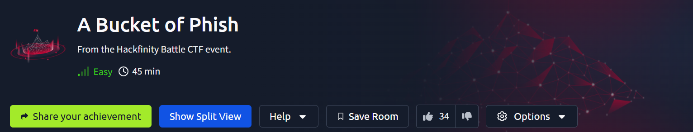
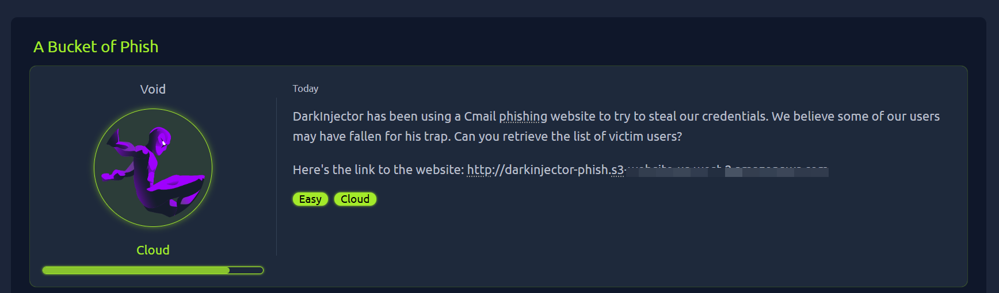
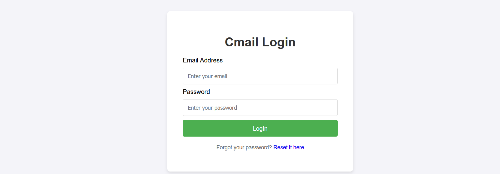
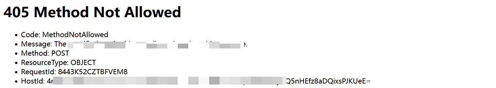
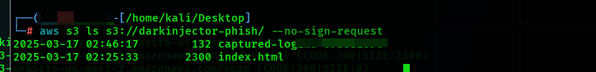

我们观察一下这个url,并且访问。





我们输入邮箱和密码，点击登录就会跳转报错，，根据报错和url中的s3，怀疑是云安全存储桶问题



我们先检查一下存储通是否配置不当

查看一下资源列表



我们可以看到其中有一个文件，直接访问就可以得到flag了

命令：aws s3 ls s3://darkinjector-phish/ --no-sign-request 

其中aws，我们直接在kali里面安装

```
pip install awscli
```

