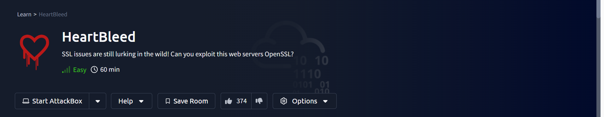
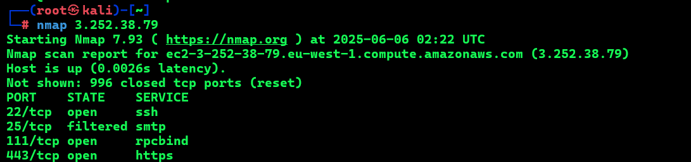
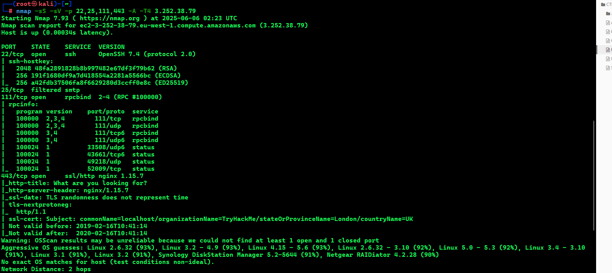
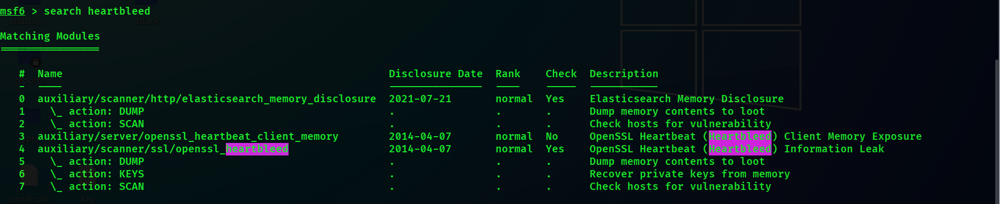
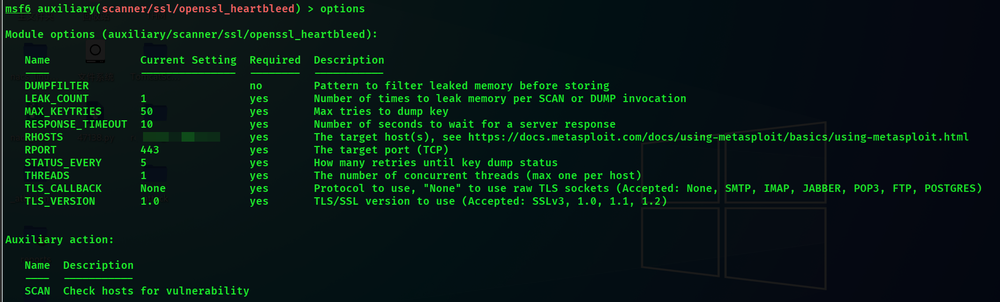
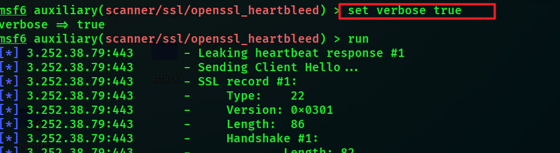
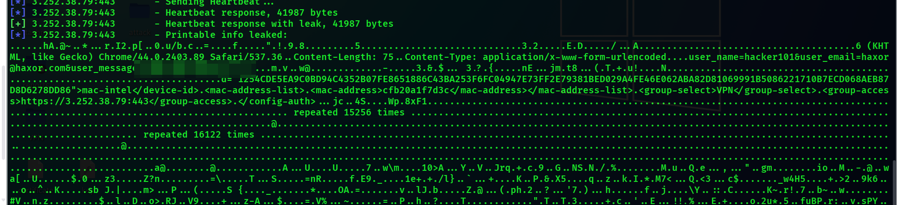

心脏滴血，靶机名字跟漏洞是一样的，允许攻击者窃取信息。

我们再对具体的版本和信息进行二次探测

 nmap -p 22,25,111,443 --script vuln  3.252.38.7

很遗憾，我的脚本执行有问题，但是我们确认是heartbleed，我们直接去执行

选择载荷4

我们继续set verbose true

这样可以看到详细模式

这样就得到flag了。

